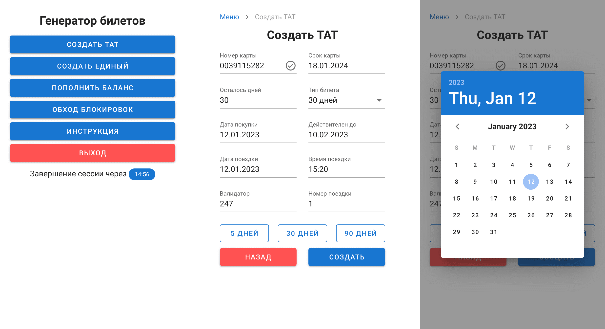
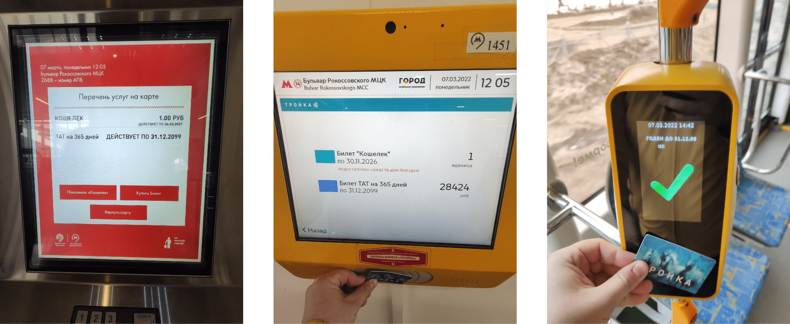

# Инструмент для генерации проездных билетов метро и наземного транспорта Москвы

Позволяет сгенерировать все виды проездных билетов, а также записать любой баланс на карту `Тройка`. Билеты `Единый` и `ТАТ` создаются на 30, 90 и 365 дней без ограничения по количеству поездок. `Пополнение баланса` карты возможно на любую сумму от 1 до 10.000 рублей.

## Создание и запись билета

С помощью интерфейса можно гибко настроить все используемые параметры. А для записи проездного билета или изменения баланса карты необходим только смартфон с `NFC`.

Сгенерированные билеты ничем не отличаются от купленных в кассе, проходят проверку на любых терминалах и киосках, в приложениях для смартфонов, а также проверяющих устройствах контроллеров.

В реальности не рекомендуется устанавливать такие нереальные даты, так как при проверке билета контроллерами к вам возникнут вопросы.

## Получение доступа

Для приобретения исходного кода или доступа к интерфейсу инструмента обращайтесь в <a href="https://t.me/dedol">Telegram</a>
